# PE-Eval: AI-Powered Private Equity Document Analysis

PE-Eval is an intelligent document analysis system that automatically extracts financial metrics from private equity documents and provides real-time monitoring of portfolio company performance.

## 🎯 Overview

Transform manual financial document analysis into an automated, intelligent system that monitors Google Drive folders, extracts key metrics using AI, and tracks changes over time.

### Key Features

- **📁 Automatic Document Monitoring**: Watches Google Drive folders for new financial documents
- **🧠 AI-Powered Extraction**: Uses GPT-4 to extract financial metrics with confidence scoring
- **⚡ Real-Time Analysis**: Processes documents within 2-5 minutes of upload
- **📈 Historical Tracking**: Maintains complete audit trails and trend analysis
- **🔔 Smart Alerts**: Notifications for significant metric changes (>10% or >$1M)
- **✅ Quality Assurance**: Multi-level validation with manual review queues

## 🏗️ Architecture

### System Components

```mermaid
graph LR
    A[📁 Google Drive] --> B[⚡ N8N Automation]
    B --> C[🧠 AI Extraction]
    C --> D[📊 Data Storage]
    D --> E[📈 Analysis Dashboard]

    style A fill:#e3f2fd
    style C fill:#fff3e0
    style D fill:#e8f5e8
```



### Technology Stack

#### Confirmed Technologies
- **Automation**: N8N workflow platform
- **AI Processing**: OpenAI GPT-4 for document analysis
- **Monitoring**: Google Drive API for document detection
- **Integration**: Claude Code with MCP servers

#### Under Evaluation
- **Data Storage**: Evaluating options including Google Sheets, PostgreSQL, or other database solutions for metrics storage and historical tracking

## 🚀 Quick Start

### Prerequisites

- Docker and Docker Compose
- N8N instance (local or cloud)
- Google Drive API credentials
- OpenAI API key
- Data storage solution (choice TBD)

### Installation

1. **Clone the repository**
   ```bash
   git clone <repository-url>
   cd pe-eval
   ```

2. **Set up environment variables**
   ```bash
   cp .env.example .env
   # Edit .env with your API keys and storage credentials
   ```

3. **Start the services**
   ```bash
   docker-compose up -d
   ```

4. **Import N8N workflows**
   ```bash
   # Access N8N at http://localhost:5678
   # Import workflows from n8n/workflows/
   ```

### Configuration

#### Google Drive Setup
1. Create a dedicated folder for each portfolio company
2. Share folders with the service account
3. Configure folder IDs in the N8N workflow

#### Data Storage Setup
Configuration will depend on chosen storage solution (Google Sheets, PostgreSQL, etc.)

## 📄 Document Processing Flow

### 1. Document Detection
- Google Drive webhook triggers on new file upload
- Supports PDF, Excel, Word, PowerPoint formats
- Automatic OCR for scanned documents

### 2. AI Extraction
- GPT-4 analyzes document content
- Extracts financial metrics with confidence scores
- Identifies: Revenue, EBITDA, Cash Flow, Growth Rates, Customer Metrics

### 3. Data Validation (PROPOSED)
- **High Quality (>85%)**: Auto-approved and stored
- **Medium Quality (60-85%)**: Manual review queue
- **Low Quality (<60%)**: Rejected with error logging

### 4. Historical Analysis
- Compares against previous periods
- Calculates percentage changes
- Identifies significant trends and anomalies

## 📊 Example Metrics
### Core Financial Metrics
- **Revenue**
- **EBITDA**
- **Cash Flow**
- **Growth Rates**
- **Customer Metrics**
- **ARR/MRR**
- **Burn Rate**
- **Valuation**

### Project Structure

```
pe-eval/
├── docs/                    # Documentation and architecture
├── n8n/workflows/          # N8N automation workflows
├── .mcp.json              # MCP server configuration
├── .env                   # Environment variables
└── README.md              # This file
```

### Common Commands

```bash
# Start N8N locally
docker run -it --rm --name n8n -p 5678:5678 -v ~/.n8n:/home/node/.n8n n8nio/n8n

# Check workflow status
curl -X GET http://localhost:5678/api/v1/workflows

# View execution logs
curl -X GET http://localhost:5678/api/v1/executions
```

### Testing

```bash
# Test document processing
# Upload test document to monitored folder
# Check extraction results in chosen data storage

# Validation commands will depend on storage solution choice
# (Google Sheets API, PostgreSQL, or other database solution)
```

### Workflow Configuration

Key N8N workflow parameters:
- **Polling Interval**: Every minute for document detection
- **Folder Monitoring**: Configurable Google Drive folder IDs
- **Processing Timeout**: 5 minutes per document
- **Retry Logic**: 3 attempts with exponential backoff

## 📚 Related Documentation

- [System Architecture](docs/SYSTEM_ARCHITECTURE.md)
- [Project Overview](docs/PROJECT_OVERVIEW.md)

---

*PE-Eval: Transforming private equity document analysis through intelligent automation*