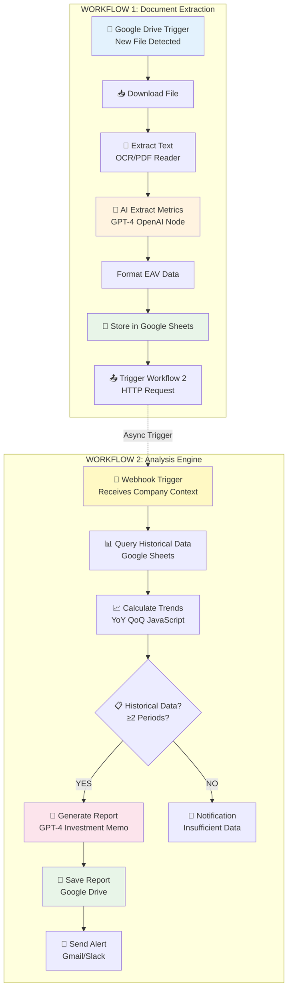

# Private Equity Financial Metrics Extraction System Architecture

## System Overview

This is an AI-powered N8N automation system that extracts financial metrics from private equity documents and generates automated investment analysis reports.

**Architecture Pattern**: Two-workflow modular design
- **Workflow 1**: Document extraction and data storage
- **Workflow 2**: Historical analysis and report generation

## Implementation Status Legend
🟢 **IMPLEMENTED** - Currently working in production
🟡 **IN PROGRESS** - Currently being developed
🔴 **PLANNED** - Not yet implemented

**Live Implementation Details**: See [[LIVE_TECHNICAL_DOC#workflow-overview|Live Technical Documentation]] for current working system.

## Visual System Flow

**Two-Workflow Modular Architecture**


```mermaid
graph TB
    subgraph Workflow1[WORKFLOW 1: Document Extraction]
        A[📁 Google Drive Trigger<br/>New File Detected] --> B[📥 Download File]
        B --> C[📄 Extract Text<br/>OCR/PDF Reader]
        C --> D[🤖 AI Extract Metrics<br/>GPT-4 OpenAI Node]
        D --> E[Format EAV Data]
        E --> F[💾 Store in Google Sheets]
        F --> G[📤 Trigger Workflow 2<br/>HTTP Request]
    end

    subgraph Workflow2[WORKFLOW 2: Analysis Engine]
        H[🔔 Webhook Trigger<br/>Receives Company Context] --> I[📊 Query Historical Data<br/>Google Sheets]
        I --> J[📈 Calculate Trends<br/>YoY QoQ JavaScript]
        J --> K{📋 Historical Data?<br/>≥2 Periods?}
        K -->|YES| L[🤖 Generate Report<br/>GPT-4 Investment Memo]
        K -->|NO| M[📧 Notification<br/>Insufficient Data]
        L --> N[💾 Save Report<br/>Google Drive]
        N --> O[📧 Send Alert<br/>Gmail/Slack]
    end

    G -.->|Async Trigger| H

    style A fill:#e3f2fd
    style D fill:#fff3e0
    style F fill:#e8f5e8
    style H fill:#fff9c4
    style L fill:#fce4ec
    style N fill:#e8f5e8
```

## N8N Workflows: Detailed Specifications

---

## WORKFLOW 1: Document Extraction Pipeline

### TRIGGER: Google Drive Folder Monitor 🟢 **IMPLEMENTED**
**Implementation**: [[LIVE_TECHNICAL_DOC#node-1-google-drive-trigger|Node 1: Google Drive Trigger]]
```
WHEN new file appears in company-specific Google Drive folder
DO download file and start processing
```
**Status**: ✅ Working with 60-second polling interval
**Current Config**: Monitors specific folder, triggers on `fileCreated` events
**Architecture Note**: Each portfolio company has dedicated 1:1 folder mapping

### STEP 1: Document Processing 🟢 **IMPLEMENTED**
**Implementation**:
- [[LIVE_TECHNICAL_DOC#node-2-download-file-from-drive|Node 2: Download File]]
- [[LIVE_TECHNICAL_DOC#node-3-extract-text-from-file|Node 3: Extract Text]]
```
DOWNLOAD file from Google Drive
EXTRACT text from PDF/Excel/Word using OCR if needed
```
**Status**:
- ✅ File download working (Google Drive OAuth2)
- ✅ Text extraction working (PDF, Excel, Word, PowerPoint + OCR)

### STEP 2: AI Metrics Extraction 🟡 **PARTIAL**
**Implementation**: [[LIVE_TECHNICAL_DOC#node-5-ai-validation-openai|Node 5: AI Validation (OpenAI)]]
```
SEND extracted text to OpenAI GPT-4 with prompt:
  "Extract financial metrics: Revenue, EBITDA, Cash Flow, Debt, etc.
   Return structured JSON with confidence scores"
RECEIVE structured financial data
```
**Status**:
- ✅ GPT-4 extraction working (gpt-4o model)
- ✅ Structured JSON output configured
- ❌ Confidence scoring not implemented in current prompt
- **Issue**: Prompt asks for CSV but code expects JSON format

### STEP 3: Data Validation - Quality-Based Routing 🔴 **PLANNED**
```
CALCULATE overall quality score:
  - Confidence score average (40%)
  - Completeness (30%)
  - Core metrics present (30%)

IF quality score > 0.85 AND confidence > 0.9:
  ROUTE to auto-approval
ELSE IF quality score > 0.6 AND confidence > 0.7:
  ROUTE to manual review queue
ELSE:
  ROUTE to rejection/error handling
```
**Status**: ❌ Not implemented - all data currently goes directly to storage
**Current Behavior**: Basic error handling in [[LIVE_TECHNICAL_DOC#node-6-prepare-sheet-data-javascript-code|Node 6: Prepare Sheet Data]]

### STEP 4: Database Storage 🟢 **IMPLEMENTED**
**Implementation**: [[LIVE_TECHNICAL_DOC#node-6-update-google-sheet|Node 6: Update Google Sheet]]
```
STORE approved metrics in Google Sheets (EAV format):
  - Company name, period, document type
  - All extracted metrics as JSON
  - Confidence scores, extraction context
  - Processing timestamp
```
**Status**:
- ✅ Data storage working (Google Sheets with EAV format)
- ✅ Auto-maps JSON keys to sheet columns, appends rows
- ✅ Flexible schema supports any metric type
- 🟡 **Enhancement needed**: Add `folder_id` column for reliable company identification

### STEP 5: Trigger Analysis Workflow 🟡 **IN PROGRESS**
**Implementation**: [[LIVE_TECHNICAL_DOC#node-7-trigger-analysis-workflow|Node 7: HTTP Request]] (Planned)
```
SEND HTTP POST request to Workflow 2 with:
  - folder_id (unique company identifier)
  - company_name
  - latest_period
  - document_name
```
**Status**: 🟡 Planned for immediate implementation
**Purpose**: Asynchronously triggers analysis workflow while keeping extraction pipeline fast

---

## WORKFLOW 2: Analysis & Report Generation Engine

**Status**: 🟡 **IN PROGRESS** - Complete specification ready for implementation

**Purpose**: Historical trend analysis and automated investment memo generation

**Trigger**: HTTP webhook called by Workflow 1 after successful data storage

### NODE 1: Webhook Trigger 🟡 **IN PROGRESS**
```
RECEIVE webhook POST request with:
  - folder_id: Unique company identifier from Google Drive
  - company_name: Extracted company name
  - latest_period: Most recent period (e.g., "2025-Q1")
  - document_name: Source document filename
```
**Configuration**:
- Node Type: Webhook Trigger
- Method: POST
- Authentication: None (internal n8n workflow)

### NODE 2: Query Historical Data 🟡 **IN PROGRESS**
```
QUERY Google Sheets for company historical data:
  SELECT * FROM metrics_sheet
  WHERE folder_id = {{ $json.folder_id }}
  ORDER BY period DESC, date_added DESC
```
**Configuration**:
- Node Type: Google Sheets (Read Rows)
- Filter: folder_id matches input
- Sort: By period (descending)
- Returns: All historical metrics for this company

### NODE 3: Calculate Trends (JavaScript) 🟡 **IN PROGRESS**
```javascript
// Group metrics by period
const metricsByPeriod = groupByPeriod(historicalData);

// Calculate trends for each metric
FOR each metric in latest period:
  FIND prior_quarter value (QoQ)
  FIND prior_year value (YoY)

  CALCULATE:
    - QoQ change % = (current - prior_quarter) / prior_quarter * 100
    - YoY change % = (current - prior_year) / prior_year * 100
    - Trend direction = growing | declining | stable
    - Significance = high | moderate | low (based on % change thresholds)

  OUTPUT enriched metric with trends
```
**Configuration**:
- Node Type: Code (JavaScript)
- Input: Historical data from Node 2
- Output: Enriched metrics with YoY, QoQ trends

### NODE 4: Check Data Sufficiency (IF Node) 🟡 **IN PROGRESS**
```
IF periods_analyzed >= 2:
  ROUTE TO: Analysis generation (sufficient historical data)
ELSE:
  ROUTE TO: Notification (insufficient data for trends)
```
**Configuration**:
- Node Type: IF
- Condition: Number of periods >= 2
- TRUE path: Continue to report generation
- FALSE path: Send "need more data" notification

### NODE 5: Generate Investment Memo (OpenAI) 🟡 **IN PROGRESS**
```
SEND TO GPT-4 with structured prompt:
  - Company context
  - Financial trends (with YoY/QoQ changes)
  - Latest document metadata

GENERATE investment analysis report in SAMPLE_EMAIL_OUTPUT format:
  - Executive Summary (recommendation, key thesis)
  - Financial Highlights (metrics with trends)
  - Investment Thesis (strengths, risks)
  - Recommendations & Next Steps
```
**Configuration**:
- Node Type: OpenAI Chat Model
- Model: gpt-4o
- Temperature: 0.4 (balanced creativity + consistency)
- Max Tokens: 4000
- Output: Markdown-formatted investment memo

### NODE 6: Save Report (Google Drive) 🟡 **IN PROGRESS**
```
SAVE generated report to company folder:
  - Filename: {{ company_name }}_Investment_Analysis_{{ date }}.md
  - Folder: Same folder as source documents (folder_id)
  - Format: Markdown
```
**Configuration**:
- Node Type: Google Drive (Upload)
- Parent Folder: {{ $('Webhook').item.json.folder_id }}
- Filename: Dynamic based on company and date
- Content: Report from Node 5

### NODE 7: Send Notification (Gmail/Slack) 🟡 **IN PROGRESS**
```
SEND alert to investment team:
  - Subject: "New Analysis Ready: {{ company_name }} - {{ period }}"
  - Body: Executive summary + link to full report
  - Recipients: Investment team distribution list
```
**Configuration**:
- Node Type: Gmail or Slack
- Template: Professional email/message format
- Attachments: Link to Google Drive report

---

## Workflow 2: Data Flow Summary

```
Webhook (company context)
  → Query historical (Google Sheets)
  → Calculate trends (JavaScript YoY/QoQ)
  → Check sufficiency (IF ≥2 periods)
  → Generate report (GPT-4 investment memo)
  → Save report (Google Drive)
  → Send notification (Gmail/Slack)
```

**Processing Time**: 1-3 minutes per analysis
**Cost**: ~$0.02-0.05 per report (GPT-4 API)

## Database Schema for Metrics Tracking 🔴 **PLANNED**
**Current**: Using Google Sheets instead - see [[LIVE_TECHNICAL_DOC#google-sheet-structure|Live Google Sheet Structure]]

```sql
-- Core Companies Table
CREATE TABLE companies (
    id UUID PRIMARY KEY,
    name VARCHAR(255) NOT NULL,
    industry VARCHAR(100),
    investment_date DATE,
    status VARCHAR(50) DEFAULT 'active',
    created_at TIMESTAMP DEFAULT NOW()
);

-- Documents Storage
CREATE TABLE documents (
    id UUID PRIMARY KEY,
    company_id UUID REFERENCES companies(id),
    filename VARCHAR(255),
    file_hash VARCHAR(64) UNIQUE,
    document_type VARCHAR(100),
    period_start DATE,
    period_end DATE,
    upload_source VARCHAR(100),
    processed_at TIMESTAMP,
    created_at TIMESTAMP DEFAULT NOW()
);

-- Metric Definitions
CREATE TABLE metric_definitions (
    id UUID PRIMARY KEY,
    name VARCHAR(255) UNIQUE,
    category VARCHAR(100),
    data_type VARCHAR(50),
    unit VARCHAR(50),
    description TEXT
);

-- Final Validated Metrics
CREATE TABLE metric_values (
    id UUID PRIMARY KEY,
    company_id UUID REFERENCES companies(id),
    metric_definition_id UUID REFERENCES metric_definitions(id),
    period_date DATE,
    current_value DECIMAL(20,4),
    prior_value DECIMAL(20,4),
    currency VARCHAR(3),
    confidence_score DECIMAL(3,2),
    quality_score DECIMAL(3,2),
    source_document_id UUID REFERENCES documents(id),
    extraction_metadata JSONB,
    is_current_version BOOLEAN DEFAULT true,
    created_at TIMESTAMP DEFAULT NOW(),

    UNIQUE(company_id, metric_definition_id, period_date)
);

-- Change Tracking
CREATE TABLE metric_changes (
    id UUID PRIMARY KEY,
    metric_value_id UUID REFERENCES metric_values(id),
    change_type VARCHAR(50),
    percentage_change DECIMAL(8,4),
    absolute_change DECIMAL(20,4),
    comparison_period DATE,
    significance_level VARCHAR(20),
    trend_direction VARCHAR(20),
    detected_at TIMESTAMP DEFAULT NOW()
);

-- Performance Indexes
CREATE INDEX idx_metrics_company_period ON metric_values(company_id, period_date);
CREATE INDEX idx_changes_significance ON metric_changes(significance_level, detected_at);
```

## Key System Features

### 🔍 **Intelligent Document Processing**
- ✅ Multi-format support (PDF, Excel, PowerPoint) - [[LIVE_TECHNICAL_DOC#node-3-extract-text-from-file|Implementation]]
- ✅ Advanced OCR with fallback services - [[LIVE_TECHNICAL_DOC#supported-file-types|Supported File Types]]
- 🔴 Smart document classification - *Not implemented*
- 🔴 Multi-language support - *Not implemented*

### 🤖 **AI-Powered Extraction**
- ✅ GPT-4 powered metric identification - [[LIVE_TECHNICAL_DOC#node-5-ai-validation-openai|Implementation]]
- 🔴 Confidence scoring for every extraction - *Not implemented*
- 🟡 Comprehensive financial metric coverage - *Limited to Income Statements*
- 🔴 Source text attribution for audit trails - *Not implemented*

### 📊 **Advanced Change Monitoring**
- 🔴 Historical trend analysis - *Not implemented*
- 🔴 Pattern recognition (growth, decline, volatility) - *Not implemented*
- 🔴 Multi-period comparisons - *Not implemented*

**Current Status**: Basic extraction pipeline working, intelligence features planned.
**Implementation Details**: See [[LIVE_TECHNICAL_DOC|Complete Technical Documentation]]