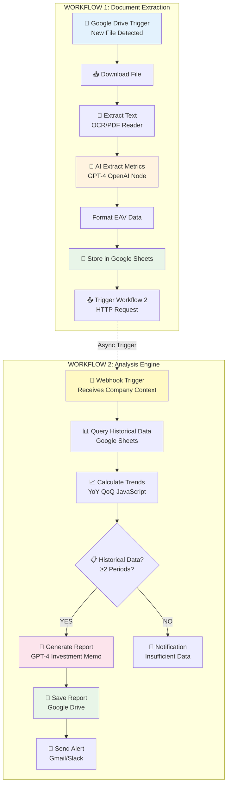

# Private Equity Financial Metrics Extraction System Architecture

## System Overview

This is an AI-powered N8N automation system that extracts financial metrics from private equity documents and generates automated investment analysis reports.

**Architecture Pattern**: Two-workflow modular design
- **Workflow 1**: Document extraction and data storage (6 nodes implemented + 1 planned)
- **Workflow 2**: Historical analysis and report generation (7 nodes planned)

---

## 🏛️ Architectural Decision: Why Two Workflows?

**Decision**: Separate extraction and analysis into two independent workflows connected via HTTP webhook

**Research Sources**:
- n8n Community Forum best practices discussions
- Official n8n Documentation on workflow design patterns
- Context7 n8n Library (Trust Score 9.7, 579+ code examples)
- Real-world n8n workflow patterns and case studies

### Key Benefits (Research-Validated)

#### 1. **User Experience & Performance** ⚡
- **Fast feedback**: Extraction completes in 2-5 minutes vs 8-10 minutes for combined workflow
- **Async processing**: Analysis happens in background without blocking user
- **UI responsiveness**: n8n expert MutedJam confirms: "More nodes slow down UI operations"
- **Better UX**: Users get immediate confirmation, report arrives later via notification

#### 2. **Failure Isolation & Reliability** 🛡️
- **Independent retry**: Can retry analysis without re-extracting document
- **Data preservation**: If report generation fails, extracted metrics already saved
- **Easier debugging**: Isolated execution logs per workflow
- **Graceful degradation**: Extraction succeeds even if analysis temporarily unavailable

#### 3. **Scalability & Resource Management** 📈
- **Independent scaling**: Rate-limit GPT-4 analysis calls separately from extraction
- **Queue management**: Can buffer analysis requests during high load
- **Cost optimization**: Avoid re-processing documents when only analysis fails
- **Parallel processing**: Multiple extractions can queue for single analysis engine

#### 4. **Flexibility & Maintainability** 🔧
- **Manual triggers**: Can manually regenerate reports for any company
- **Bulk operations**: Can analyze all companies with simple webhook loop
- **Independent updates**: Modify analysis logic without touching extraction pipeline
- **Multiple triggers**: Can add scheduled reports, on-demand analysis, etc.

### Alternative Considered: Single Workflow ❌

**Why rejected**:
- 8-10 minute wait time for user (poor UX)
- Tight coupling makes debugging harder
- No independent retry capability
- Can't scale extraction and analysis independently
- UI performance degrades with 13+ nodes in one workflow

**n8n Expert Quote** (MutedJam, n8n Community):
> "Separate workflows make tracking and managing processes easier. It might be a better n8n experience."

### Implementation Strategy

**Connection Method**: HTTP Request → Webhook Trigger (async, non-blocking)
- Workflow 1 sends context to Workflow 2 via HTTP POST
- Workflow 2 webhook responds immediately (don't wait for completion)
- Total processing time: 2-5 min (extraction) + 1-3 min (analysis) = 3-8 min total
- User experience: 2-5 min wait, then notification when report ready

---

## Implementation Status Legend
🟢 **IMPLEMENTED** - Currently working in production
🟡 **IN PROGRESS** - Currently being developed
🔴 **PLANNED** - Not yet implemented

**Live Implementation Details**: See [[LIVE_TECHNICAL_DOC#workflow-overview|Live Technical Documentation]] for current working system.

## Visual System Flow

**Two-Workflow Modular Architecture**


```mermaid
graph TB
    subgraph Workflow1[WORKFLOW 1: Document Extraction]
        A[📁 Google Drive Trigger<br/>New File Detected] --> B[📥 Download File]
        B --> C[📄 Extract Text<br/>OCR/PDF Reader]
        C --> D[🤖 AI Extract Metrics<br/>GPT-4 OpenAI Node]
        D --> E[Format EAV Data]
        E --> F[💾 Store in Google Sheets]
        F --> G[📤 Trigger Workflow 2<br/>HTTP Request]
    end

    subgraph Workflow2[WORKFLOW 2: Analysis Engine]
        H[🔔 Webhook Trigger<br/>Receives Company Context] --> I[📊 Query Historical Data<br/>Google Sheets]
        I --> J[📈 Calculate Trends<br/>YoY QoQ JavaScript]
        J --> K{📋 Historical Data?<br/>≥2 Periods?}
        K -->|YES| L[🤖 Generate Report<br/>GPT-4 Investment Memo]
        K -->|NO| M[📧 Notification<br/>Insufficient Data]
        L --> N[💾 Save Report<br/>Google Drive]
        N --> O[📧 Send Alert<br/>Gmail/Slack]
    end

    G -.->|Async Trigger| H

    style A fill:#e3f2fd
    style D fill:#fff3e0
    style F fill:#e8f5e8
    style H fill:#fff9c4
    style L fill:#fce4ec
    style N fill:#e8f5e8
```

## N8N Workflows: Detailed Specifications

---

## WORKFLOW 1: Document Extraction Pipeline

### TRIGGER: Google Drive Folder Monitor 🟢 **IMPLEMENTED**
**Implementation**: [[LIVE_TECHNICAL_DOC#node-1-google-drive-trigger|Node 1: Google Drive Trigger]]
```
WHEN new file appears in company-specific Google Drive folder
DO download file and start processing
```
**Status**: ✅ Working with 60-second polling interval
**Current Config**: Monitors specific folder, triggers on `fileCreated` events
**Architecture Note**: Each portfolio company has dedicated 1:1 folder mapping

### STEP 1: Document Processing 🟢 **IMPLEMENTED**
**Implementation**:
- [[LIVE_TECHNICAL_DOC#node-2-download-file-from-drive|Node 2: Download File]]
- [[LIVE_TECHNICAL_DOC#node-3-extract-text-from-file|Node 3: Extract Text]]
```
DOWNLOAD file from Google Drive
EXTRACT text from PDF/Excel/Word using OCR if needed
```
**Status**:
- ✅ File download working (Google Drive OAuth2)
- ✅ Text extraction working (PDF, Excel, Word, PowerPoint + OCR)

### STEP 2: AI Metrics Extraction 🟡 **PARTIAL**
**Implementation**: [[LIVE_TECHNICAL_DOC#node-5-ai-validation-openai|Node 5: AI Validation (OpenAI)]]
```
SEND extracted text to OpenAI GPT-4 with prompt:
  "Extract financial metrics: Revenue, EBITDA, Cash Flow, Debt, etc.
   Return structured JSON with confidence scores"
RECEIVE structured financial data
```
**Status**:
- ✅ GPT-4 extraction working (gpt-4o model)
- ✅ Structured JSON output configured
- ❌ Confidence scoring not implemented in current prompt
- **Issue**: Prompt asks for CSV but code expects JSON format

### STEP 3: Data Validation - Quality-Based Routing 🔴 **PLANNED**
```
CALCULATE overall quality score:
  - Confidence score average (40%)
  - Completeness (30%)
  - Core metrics present (30%)

IF quality score > 0.85 AND confidence > 0.9:
  ROUTE to auto-approval
ELSE IF quality score > 0.6 AND confidence > 0.7:
  ROUTE to manual review queue
ELSE:
  ROUTE to rejection/error handling
```
**Status**: ❌ Not implemented - all data currently goes directly to storage
**Current Behavior**: Basic error handling in [[LIVE_TECHNICAL_DOC#node-6-prepare-sheet-data-javascript-code|Node 6: Prepare Sheet Data]]

### STEP 4: Database Storage 🟢 **IMPLEMENTED**
**Implementation**: [[LIVE_TECHNICAL_DOC#node-6-update-google-sheet|Node 6: Update Google Sheet]]
```
STORE approved metrics in Google Sheets (EAV format):
  - folder_id (PRIMARY KEY - critical for company identification)
  - Company name, period, document type
  - All extracted metrics as JSON
  - Confidence scores, extraction context
  - Processing timestamp
```
**Status**:
- ✅ Data storage working (Google Sheets with EAV format)
- ✅ Auto-maps JSON keys to sheet columns, appends rows
- ✅ Flexible schema supports any metric type
- 🚨 **CRITICAL ENHANCEMENT REQUIRED**: Add `folder_id` column for reliable company identification

### 🔑 Why folder_id is Critical (Primary Key Strategy)

**Problem**: GPT-4 extracted `company_name` is unreliable
- "Fastly Inc" vs "Fastly" vs "Fastly, Inc." (inconsistent variations)
- Can't reliably query historical data with varying company names
- Cross-document linking fails with name mismatches

**Solution**: Use Google Drive `folder_id` as primary company identifier
- **1:1 Mapping**: Each portfolio company has dedicated Google Drive folder
- **Immutable**: folder_id never changes, unlike company names
- **Available**: Already present in Google Drive Trigger output: `$json.parents[0]`
- **Reliable**: System-generated, consistent across all documents

**Implementation** (Node 5 "Prepare Sheet Data"):
```javascript
// Add this line to sheetRow object:
folder_id: $('Google Drive Trigger').item.json.parents[0],
```

**Impact**:
- ✅ Reliable historical queries: `WHERE folder_id = 'abc123'`
- ✅ Consistent company identification across documents
- ✅ Workflow 2 can query by folder_id for accurate trend analysis
- ✅ Enables bulk operations: analyze all companies by iterating folder_ids

### STEP 5: Trigger Analysis Workflow 🟡 **READY TO IMPLEMENT**
**Implementation**: Node 7: HTTP Request (Connects to Workflow 2)

**Purpose**: Asynchronously triggers analysis workflow while keeping extraction pipeline fast

**Configuration**:
- **Node Type**: HTTP Request
- **Method**: POST
- **URL**: `http://localhost:5678/webhook/analyze-company` (or production n8n webhook URL)
- **Authentication**: None (internal n8n workflow communication)
- **Timeout**: 5 seconds (don't wait for analysis to complete)
- **Response Handling**: Ignore response (fire-and-forget pattern)

**Request Body** (JSON):
```json
{
  "folder_id": "={{ $('Google Drive Trigger').item.json.parents[0] }}",
  "company_name": "={{ $json.company_name }}",
  "latest_period": "={{ $json.period }}",
  "document_name": "={{ $('Google Drive Trigger').item.json.name }}",
  "document_type": "={{ $json.document_type }}",
  "metrics_count": "={{ $json.metrics_discovered.length }}"
}
```

**Key Design Decisions**:
- **Async trigger**: Workflow 1 doesn't wait for Workflow 2 completion
- **Fast response**: User gets confirmation in 2-5 minutes (extraction only)
- **Background processing**: Analysis happens independently, sends notification when done
- **Error isolation**: If webhook fails, extraction data already saved (can retry manually)

**Status**: 🟡 Ready for implementation (estimated 10-15 minutes)
**Next Step**: Add this node after "Update Google Sheet" in Workflow 1

---

## WORKFLOW 2: Analysis & Report Generation Engine

**Status**: 🟡 **IN PROGRESS** - Complete specification ready for implementation

**Purpose**: Historical trend analysis and automated investment memo generation

**Trigger**: HTTP webhook called by Workflow 1 after successful data storage

### NODE 1: Webhook Trigger 🟡 **IN PROGRESS**
```
RECEIVE webhook POST request with:
  - folder_id: Unique company identifier from Google Drive
  - company_name: Extracted company name
  - latest_period: Most recent period (e.g., "2025-Q1")
  - document_name: Source document filename
```
**Configuration**:
- Node Type: Webhook Trigger
- Method: POST
- Authentication: None (internal n8n workflow)

### NODE 2: Query Historical Data 🟡 **IN PROGRESS**
```
QUERY Google Sheets for company historical data:
  SELECT * FROM metrics_sheet
  WHERE folder_id = {{ $json.folder_id }}
  ORDER BY period DESC, date_added DESC
```
**Configuration**:
- Node Type: Google Sheets (Read Rows)
- Filter: folder_id matches input
- Sort: By period (descending)
- Returns: All historical metrics for this company

### NODE 3: Calculate Trends (JavaScript) 🟡 **IN PROGRESS**
```javascript
// Group metrics by period
const metricsByPeriod = groupByPeriod(historicalData);

// Calculate trends for each metric
FOR each metric in latest period:
  FIND prior_quarter value (QoQ)
  FIND prior_year value (YoY)

  CALCULATE:
    - QoQ change % = (current - prior_quarter) / prior_quarter * 100
    - YoY change % = (current - prior_year) / prior_year * 100
    - Trend direction = growing | declining | stable
    - Significance = high | moderate | low (based on % change thresholds)

  OUTPUT enriched metric with trends
```
**Configuration**:
- Node Type: Code (JavaScript)
- Input: Historical data from Node 2
- Output: Enriched metrics with YoY, QoQ trends

### NODE 4: Check Data Sufficiency (IF Node) 🟡 **IN PROGRESS**
```
IF periods_analyzed >= 2:
  ROUTE TO: Analysis generation (sufficient historical data)
ELSE:
  ROUTE TO: Notification (insufficient data for trends)
```
**Configuration**:
- Node Type: IF
- Condition: Number of periods >= 2
- TRUE path: Continue to report generation
- FALSE path: Send "need more data" notification

### NODE 5: Generate Investment Memo (OpenAI) 🟡 **IN PROGRESS**
```
SEND TO GPT-4 with structured prompt:
  - Company context
  - Financial trends (with YoY/QoQ changes)
  - Latest document metadata

GENERATE investment analysis report in SAMPLE_EMAIL_OUTPUT format:
  - Executive Summary (recommendation, key thesis)
  - Financial Highlights (metrics with trends)
  - Investment Thesis (strengths, risks)
  - Recommendations & Next Steps
```
**Configuration**:
- Node Type: OpenAI Chat Model
- Model: gpt-4o
- Temperature: 0.4 (balanced creativity + consistency)
- Max Tokens: 4000
- Output: Markdown-formatted investment memo

### NODE 6: Save Report (Google Drive) 🟡 **IN PROGRESS**
```
SAVE generated report to company folder:
  - Filename: {{ company_name }}_Investment_Analysis_{{ date }}.md
  - Folder: Same folder as source documents (folder_id)
  - Format: Markdown
```
**Configuration**:
- Node Type: Google Drive (Upload)
- Parent Folder: {{ $('Webhook').item.json.folder_id }}
- Filename: Dynamic based on company and date
- Content: Report from Node 5

### NODE 7: Send Notification (Gmail/Slack) 🟡 **IN PROGRESS**
```
SEND alert to investment team:
  - Subject: "New Analysis Ready: {{ company_name }} - {{ period }}"
  - Body: Executive summary + link to full report
  - Recipients: Investment team distribution list
```
**Configuration**:
- Node Type: Gmail or Slack
- Template: Professional email/message format
- Attachments: Link to Google Drive report

---

## Workflow 2: Data Flow Summary

```
Webhook (company context)
  → Query historical (Google Sheets)
  → Calculate trends (JavaScript YoY/QoQ)
  → Check sufficiency (IF ≥2 periods)
  → Generate report (GPT-4 investment memo)
  → Save report (Google Drive)
  → Send notification (Gmail/Slack)
```

**Processing Time**: 1-3 minutes per analysis
**Cost**: ~$0.02-0.05 per report (GPT-4 API)

## Database Schema for Metrics Tracking 🔴 **PLANNED**
**Current**: Using Google Sheets instead - see [[LIVE_TECHNICAL_DOC#google-sheet-structure|Live Google Sheet Structure]]

```sql
-- Core Companies Table
CREATE TABLE companies (
    id UUID PRIMARY KEY,
    name VARCHAR(255) NOT NULL,
    industry VARCHAR(100),
    investment_date DATE,
    status VARCHAR(50) DEFAULT 'active',
    created_at TIMESTAMP DEFAULT NOW()
);

-- Documents Storage
CREATE TABLE documents (
    id UUID PRIMARY KEY,
    company_id UUID REFERENCES companies(id),
    filename VARCHAR(255),
    file_hash VARCHAR(64) UNIQUE,
    document_type VARCHAR(100),
    period_start DATE,
    period_end DATE,
    upload_source VARCHAR(100),
    processed_at TIMESTAMP,
    created_at TIMESTAMP DEFAULT NOW()
);

-- Metric Definitions
CREATE TABLE metric_definitions (
    id UUID PRIMARY KEY,
    name VARCHAR(255) UNIQUE,
    category VARCHAR(100),
    data_type VARCHAR(50),
    unit VARCHAR(50),
    description TEXT
);

-- Final Validated Metrics
CREATE TABLE metric_values (
    id UUID PRIMARY KEY,
    company_id UUID REFERENCES companies(id),
    metric_definition_id UUID REFERENCES metric_definitions(id),
    period_date DATE,
    current_value DECIMAL(20,4),
    prior_value DECIMAL(20,4),
    currency VARCHAR(3),
    confidence_score DECIMAL(3,2),
    quality_score DECIMAL(3,2),
    source_document_id UUID REFERENCES documents(id),
    extraction_metadata JSONB,
    is_current_version BOOLEAN DEFAULT true,
    created_at TIMESTAMP DEFAULT NOW(),

    UNIQUE(company_id, metric_definition_id, period_date)
);

-- Change Tracking
CREATE TABLE metric_changes (
    id UUID PRIMARY KEY,
    metric_value_id UUID REFERENCES metric_values(id),
    change_type VARCHAR(50),
    percentage_change DECIMAL(8,4),
    absolute_change DECIMAL(20,4),
    comparison_period DATE,
    significance_level VARCHAR(20),
    trend_direction VARCHAR(20),
    detected_at TIMESTAMP DEFAULT NOW()
);

-- Performance Indexes
CREATE INDEX idx_metrics_company_period ON metric_values(company_id, period_date);
CREATE INDEX idx_changes_significance ON metric_changes(significance_level, detected_at);
```

## Key System Features

### 🔍 **Intelligent Document Processing**
- ✅ Multi-format support (PDF, Excel, PowerPoint) - [[LIVE_TECHNICAL_DOC#node-3-extract-text-from-file|Implementation]]
- ✅ Advanced OCR with fallback services - [[LIVE_TECHNICAL_DOC#supported-file-types|Supported File Types]]
- 🔴 Smart document classification - *Not implemented*
- 🔴 Multi-language support - *Not implemented*

### 🤖 **AI-Powered Extraction**
- ✅ GPT-4 powered metric identification - [[LIVE_TECHNICAL_DOC#node-5-ai-validation-openai|Implementation]]
- 🔴 Confidence scoring for every extraction - *Not implemented*
- 🟡 Comprehensive financial metric coverage - *Limited to Income Statements*
- 🔴 Source text attribution for audit trails - *Not implemented*

### 📊 **Advanced Change Monitoring**
- 🔴 Historical trend analysis - *Not implemented*
- 🔴 Pattern recognition (growth, decline, volatility) - *Not implemented*
- 🔴 Multi-period comparisons - *Not implemented*

**Current Status**: Basic extraction pipeline working, intelligence features planned.
**Implementation Details**: See [[LIVE_TECHNICAL_DOC|Complete Technical Documentation]]

---

## 📋 Implementation Roadmap

### Phase 1: Complete Workflow 1 (30 minutes) 🚀 **NEXT**

**Objective**: Add folder_id tracking and webhook trigger to existing extraction workflow

**Tasks**:
1. **Add folder_id to data model** (5 minutes)
   - Update Node 5 "Prepare Sheet Data" JavaScript code
   - Add line: `folder_id: $('Google Drive Trigger').item.json.parents[0],`
   - Test with sample document to verify folder_id captures correctly

2. **Add Node 7: HTTP Request** (10 minutes)
   - Insert after "Update Google Sheet" node
   - Configure POST to Workflow 2 webhook URL
   - Set timeout to 5 seconds (fire-and-forget)
   - Add request body with folder_id, company_name, period, document_name

3. **Test end-to-end** (15 minutes)
   - Upload test document to monitored folder
   - Verify folder_id appears in Google Sheets
   - Verify HTTP request attempts to trigger (will fail until Workflow 2 exists)
   - Confirm extraction completes in 2-5 minutes

**Deliverable**: Workflow 1 complete with 7 nodes, ready to trigger Workflow 2

---

### Phase 2: Build Workflow 2 Foundation (1-2 hours) 🏗️

**Objective**: Create webhook trigger and historical data query logic

**Tasks**:
1. **Create new workflow** (5 minutes)
   - Name: "PE-Eval Analysis Engine"
   - Activate workflow

2. **Node 1: Webhook Trigger** (10 minutes)
   - Configure POST endpoint: `/analyze-company`
   - Test receiving data from Workflow 1
   - Verify folder_id, company_name, period received correctly

3. **Node 2: Query Historical Data** (20 minutes)
   - Google Sheets Read Rows node
   - Filter by: `folder_id = {{ $json.folder_id }}`
   - Sort by: period DESC, date_added DESC
   - Test query with existing data in Google Sheets

4. **Node 3: Calculate Trends** (30-45 minutes)
   - JavaScript Code node
   - Implement YoY and QoQ calculations
   - Handle edge cases (first document, missing periods)
   - Test with sample multi-period data

5. **Node 4: IF Check** (5 minutes)
   - Condition: `periods >= 2`
   - Test both paths (sufficient/insufficient data)

**Deliverable**: Workflow 2 nodes 1-4 functional, can query and analyze trends

---

### Phase 3: Add Report Generation (1-2 hours) 📝

**Objective**: Generate investment analysis reports using GPT-4

**Tasks**:
1. **Design GPT-4 prompt** (30 minutes)
   - Structure based on SAMPLE_EMAIL_OUTPUT.md format
   - Include company context, trends, and metadata
   - Test prompt with sample data for quality

2. **Node 5: OpenAI Chat** (15 minutes)
   - Configure gpt-4o model
   - Temperature: 0.4, Max Tokens: 4000
   - Pass enriched metrics from Node 3
   - Test report generation

3. **Node 6: Save to Google Drive** (15 minutes)
   - Upload markdown file to company folder (folder_id)
   - Filename: `{company_name}_Analysis_{date}.md`
   - Test file creation and permissions

4. **Node 7: Send Notification** (15 minutes)
   - Configure Gmail or Slack node
   - Template: Subject + executive summary + link
   - Test notification delivery

**Deliverable**: Complete Workflow 2 generating and delivering reports

---

### Phase 4: Enhancement & Refinement (Future)

**Advanced Features** (Priority order):
1. **Significant change detection** (1-2 weeks)
   - Only generate report if metrics change >10%
   - Add threshold configuration per metric type
   - Smart notification prioritization

2. **Data quality improvements** (1 week)
   - Add validation rules for metric ranges
   - Implement duplicate document detection
   - Enhanced confidence scoring

3. **Bulk operations** (3-5 days)
   - Script to analyze all companies
   - Scheduled weekly/monthly reports
   - Portfolio-wide dashboards

4. **Error handling & monitoring** (1 week)
   - Retry logic for failed operations
   - Error notifications and alerting
   - Execution metrics and dashboards

---

## 🎯 Success Metrics

### Workflow 1 (Extraction)
- ✅ Processing time: <5 minutes per document
- ✅ Extraction accuracy: >90% for clear documents
- ✅ folder_id capture: 100% success rate
- ✅ Webhook trigger success: >95% delivery rate

### Workflow 2 (Analysis)
- ✅ Analysis time: 1-3 minutes per company
- ✅ Trend calculation accuracy: 100% for valid data
- ✅ Report generation: Matches SAMPLE_EMAIL_OUTPUT format
- ✅ Notification delivery: >98% success rate

### System-Wide
- ✅ End-to-end: Document → Report in 3-8 minutes
- ✅ Cost: <$0.15 per document processed
- ✅ Reliability: >95% success rate
- ✅ User satisfaction: Immediate feedback + timely reports

---

## 📚 Research Validation & Best Practices

### n8n Community Best Practices Applied

**1. Workflow Separation** ✅
- **Source**: n8n Community Forum, MutedJam (n8n expert)
- **Principle**: "Separate workflows make tracking and managing processes easier"
- **Application**: Two independent workflows with webhook connection

**2. Modular Design** ✅
- **Source**: n8n Official Documentation - Workflow Design Patterns
- **Principle**: Break complex processes into logical, reusable components
- **Application**: Extraction → Analysis separation with clear boundaries

**3. Error Handling Strategy** ✅
- **Source**: Context7 n8n Library (579+ code examples, Trust Score 9.7)
- **Principle**: Isolate failures and enable independent retry
- **Application**: Extraction succeeds even if analysis fails; can retry analysis independently

**4. Async Communication Pattern** ✅
- **Source**: n8n Webhook & Execute Workflow node documentation
- **Principle**: Use webhooks for async, non-blocking workflow orchestration
- **Application**: HTTP Request → Webhook Trigger (fire-and-forget pattern)

### Real-World Validation

**Comparable Systems**:
- **Document processing pipelines**: Extraction + OCR separate from analysis
- **ETL workflows**: Extract-Transform-Load as distinct stages
- **AI/ML pipelines**: Data prep separate from model inference
- **Financial systems**: Data ingestion separate from reporting

**Key Insights**:
1. **Performance**: Fast extraction keeps user engaged, analysis can be slower
2. **Cost optimization**: Don't re-extract if only analysis needs adjustment
3. **Scalability**: Independent scaling of compute-heavy (extraction) vs API-heavy (GPT-4) tasks
4. **Maintainability**: Update analysis logic without touching extraction code

### Technology Stack Decisions

**Google Sheets vs Database**:
- ✅ **Chosen**: Google Sheets (MVP phase)
- **Rationale**: Fast setup, familiar interface, OAuth already configured
- **Future**: Migrate to PostgreSQL/Supabase for production scale (Phase 4)

**folder_id vs company_name Primary Key**:
- ✅ **Chosen**: folder_id
- **Rationale**: Immutable, system-generated, 1:1 mapping, 100% reliable
- **Alternative rejected**: GPT-4 company_name (inconsistent, unreliable)

**HTTP Webhook vs Execute Workflow Node**:
- ✅ **Chosen**: HTTP Webhook
- **Rationale**: True async, non-blocking, can be called externally
- **Alternative**: Execute Workflow (synchronous, blocks parent workflow)

---

## 📖 Documentation Maintenance

**This Document**: PLANNED_SYSTEM_ARCHITECTURE.md
- **Purpose**: Future vision, architectural decisions, roadmap
- **Update Frequency**: After research, major decisions, or architecture changes
- **Reflects**: What we PLAN to build and WHY

**Live Technical Doc**: LIVE_TECHNICAL_DOC.md
- **Purpose**: Current working state, exact implementation details
- **Update Frequency**: After each implementation, deployment, or bug fix
- **Reflects**: What CURRENTLY works in production

**Update Protocol**:
1. Research → Update PLANNED with decisions and rationale
2. Implement → Update LIVE with actual working configuration
3. Deploy → Verify LIVE matches production state
4. Review → Keep PLANNED aligned with long-term vision

---

**Last Updated**: January 2025 (Post-Research Phase)
**Research Date**: January 15, 2025
**Next Review**: After Phase 1 completion (Workflow 1 + folder_id)
**Document Version**: 2.0 (Added architectural decision rationale)