# Private Equity Financial Metrics Extraction System Architecture

## System Overview

This is an AI-powered N8N automation system that extracts financial metrics from private equity documents and monitors changes over time.

## Implementation Status Legend
🟢 **IMPLEMENTED** - Currently working in production
🟡 **PARTIAL** - Basic version exists, needs enhancement
🔴 **PLANNED** - Not yet implemented
🔧 **IN PROGRESS** - Currently being developed

**Live Implementation Details**: See [[LIVE_TECHNICAL_DOC#workflow-overview|Live Technical Documentation]] for current working system.

## Visual System Flow

```mermaid
graph LR
    A[📁 Google Drive Folder<br/>New File Detected] --> B[📥 Download File<br/>Node]
    B --> C[📄 Extract Text<br/>OCR/PDF Reader]
    C --> D[🤖 AI Extract Metrics<br/>GPT-4 OpenAI Node]
    D --> F{Data Validation}

    F -->|High >0.85| G[💾 Store Approved<br/>PostgreSQL]
    F -->|Medium 0.6-0.85| H[👤 Manual Review<br/>Queue]
    F -->|Low <0.6| I[❌ Reject<br/>Error Log]

    G --> J[🔍 Compare Historical<br/>PostgreSQL Query]
    J --> K[📊 Detect Changes<br/>Code Node]

    style A fill:#e3f2fd
    style D fill:#fff3e0
    style G fill:#e8f5e8
    style J fill:#f3e5f5
```



## N8N Workflow: PE Financial Metrics System (Pseudocode)

### TRIGGER: Google Drive Folder Monitor 🟢 **IMPLEMENTED**
**Implementation**: [[LIVE_TECHNICAL_DOC#node-1-google-drive-trigger|Node 1: Google Drive Trigger]]
```
WHEN new file appears in "Portfolio Financial Reports" folder
DO download file and start processing
```
**Status**: ✅ Working with 60-second polling interval
**Current Config**: Monitors specific folder, triggers on `fileCreated` events

### STEP 1: Document Processing 🟢 **IMPLEMENTED**
**Implementation**:
- [[LIVE_TECHNICAL_DOC#node-2-download-file-from-drive|Node 2: Download File]]
- [[LIVE_TECHNICAL_DOC#node-3-extract-text-from-file|Node 3: Extract Text]]
```
DOWNLOAD file from Google Drive
EXTRACT text from PDF/Excel/Word using OCR if needed
```
**Status**:
- ✅ File download working (Google Drive OAuth2)
- ✅ Text extraction working (PDF, Excel, Word, PowerPoint + OCR)

### STEP 2: AI Metrics Extraction 🟡 **PARTIAL**
**Implementation**: [[LIVE_TECHNICAL_DOC#node-5-ai-validation-openai|Node 5: AI Validation (OpenAI)]]
```
SEND extracted text to OpenAI GPT-4 with prompt:
  "Extract financial metrics: Revenue, EBITDA, Cash Flow, Debt, etc.
   Return structured JSON with confidence scores"
RECEIVE structured financial data
```
**Status**:
- ✅ GPT-4 extraction working (gpt-4o model)
- ✅ Structured JSON output configured
- ❌ Confidence scoring not implemented in current prompt
- **Issue**: Prompt asks for CSV but code expects JSON format

### STEP 3: Data Validation - Quality-Based Routing 🔴 **PLANNED**
```
CALCULATE overall quality score:
  - Confidence score average (40%)
  - Completeness (30%)
  - Core metrics present (30%)

IF quality score > 0.85 AND confidence > 0.9:
  ROUTE to auto-approval
ELSE IF quality score > 0.6 AND confidence > 0.7:
  ROUTE to manual review queue
ELSE:
  ROUTE to rejection/error handling
```
**Status**: ❌ Not implemented - all data currently goes directly to storage
**Current Behavior**: Basic error handling in [[LIVE_TECHNICAL_DOC#node-6-prepare-sheet-data-javascript-code|Node 6: Prepare Sheet Data]]

### STEP 4: Database Storage 🟡 **PARTIAL**
**Implementation**: [[LIVE_TECHNICAL_DOC#node-7-update-google-sheet|Node 7: Update Google Sheet]]
```
STORE approved metrics in database:
  - Company name, period, document type
  - All extracted metrics as JSON
  - Quality scores, source document hash
  - Processing timestamp
```
**Status**:
- ❌ Data storage working (Google Sheets instead of PostgreSQL)
- ❌ No document metadata (filename, hash, timestamp)
- ❌ No quality scores stored
- ❌ No unique constraints or duplicate detection
- **Current**: Auto-maps JSON keys to sheet columns, appends rows

### STEP 5: Historical Comparison 🔴 **PLANNED**
```
QUERY database for previous periods of same company
CALCULATE percentage changes for each metric
IDENTIFY trending patterns (growth, decline, volatility)
```
**Status**: ❌ Not implemented - no historical data tracking

### STEP 6: Change Detection 🔴 **PLANNED**
```
FOR each metric change:
  CALCULATE percentage changes
  IDENTIFY significant trends
  Special rules for core metrics (Revenue, EBITDA, Net Income)
```
**Status**: ❌ Not implemented - no change detection or alerts

### STEP 7: Audit Trail 🔴 **PLANNED**
```
LOG all changes in PostgreSQL with:
  - Company, metric, change details
  - Percentage change, current/prior values
  - Change reason, timestamp
```
**Status**: ❌ Not implemented - no audit trail or change logging

## Database Schema for Metrics Tracking 🔴 **PLANNED**
**Current**: Using Google Sheets instead - see [[LIVE_TECHNICAL_DOC#google-sheet-structure|Live Google Sheet Structure]]

```sql
-- Core Companies Table
CREATE TABLE companies (
    id UUID PRIMARY KEY,
    name VARCHAR(255) NOT NULL,
    industry VARCHAR(100),
    investment_date DATE,
    status VARCHAR(50) DEFAULT 'active',
    created_at TIMESTAMP DEFAULT NOW()
);

-- Documents Storage
CREATE TABLE documents (
    id UUID PRIMARY KEY,
    company_id UUID REFERENCES companies(id),
    filename VARCHAR(255),
    file_hash VARCHAR(64) UNIQUE,
    document_type VARCHAR(100),
    period_start DATE,
    period_end DATE,
    upload_source VARCHAR(100),
    processed_at TIMESTAMP,
    created_at TIMESTAMP DEFAULT NOW()
);

-- Metric Definitions
CREATE TABLE metric_definitions (
    id UUID PRIMARY KEY,
    name VARCHAR(255) UNIQUE,
    category VARCHAR(100),
    data_type VARCHAR(50),
    unit VARCHAR(50),
    description TEXT
);

-- Final Validated Metrics
CREATE TABLE metric_values (
    id UUID PRIMARY KEY,
    company_id UUID REFERENCES companies(id),
    metric_definition_id UUID REFERENCES metric_definitions(id),
    period_date DATE,
    current_value DECIMAL(20,4),
    prior_value DECIMAL(20,4),
    currency VARCHAR(3),
    confidence_score DECIMAL(3,2),
    quality_score DECIMAL(3,2),
    source_document_id UUID REFERENCES documents(id),
    extraction_metadata JSONB,
    is_current_version BOOLEAN DEFAULT true,
    created_at TIMESTAMP DEFAULT NOW(),

    UNIQUE(company_id, metric_definition_id, period_date)
);

-- Change Tracking
CREATE TABLE metric_changes (
    id UUID PRIMARY KEY,
    metric_value_id UUID REFERENCES metric_values(id),
    change_type VARCHAR(50),
    percentage_change DECIMAL(8,4),
    absolute_change DECIMAL(20,4),
    comparison_period DATE,
    significance_level VARCHAR(20),
    trend_direction VARCHAR(20),
    detected_at TIMESTAMP DEFAULT NOW()
);

-- Performance Indexes
CREATE INDEX idx_metrics_company_period ON metric_values(company_id, period_date);
CREATE INDEX idx_changes_significance ON metric_changes(significance_level, detected_at);
```

## Key System Features

### 🔍 **Intelligent Document Processing**
- ✅ Multi-format support (PDF, Excel, PowerPoint) - [[LIVE_TECHNICAL_DOC#node-3-extract-text-from-file|Implementation]]
- ✅ Advanced OCR with fallback services - [[LIVE_TECHNICAL_DOC#supported-file-types|Supported File Types]]
- 🔴 Smart document classification - *Not implemented*
- 🔴 Multi-language support - *Not implemented*

### 🤖 **AI-Powered Extraction**
- ✅ GPT-4 powered metric identification - [[LIVE_TECHNICAL_DOC#node-5-ai-validation-openai|Implementation]]
- 🔴 Confidence scoring for every extraction - *Not implemented*
- 🟡 Comprehensive financial metric coverage - *Limited to Income Statements*
- 🔴 Source text attribution for audit trails - *Not implemented*

### 📊 **Advanced Change Monitoring**
- 🔴 Historical trend analysis - *Not implemented*
- 🔴 Pattern recognition (growth, decline, volatility) - *Not implemented*
- 🔴 Multi-period comparisons - *Not implemented*

**Current Status**: Basic extraction pipeline working, intelligence features planned.
**Implementation Details**: See [[LIVE_TECHNICAL_DOC|Complete Technical Documentation]]